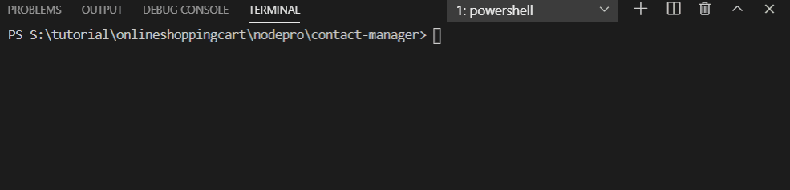

# CLI-with-Node-js
A command line interface for contact management system

## Install
    $ git clone https://github.com/siddharth151199/CLI-with-Node-js.git
    $ cd PROJECT_TITLE
    $ npm install

## Running the project

  node contact.js addContact|a          --- add a contact
  
  node contact.js getContact|f <name>    --- Get contact
  
  node contact.js updateContact|u <_id>  --- Update contact

